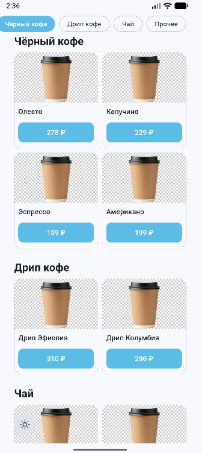
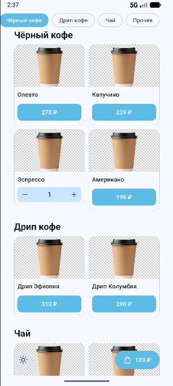
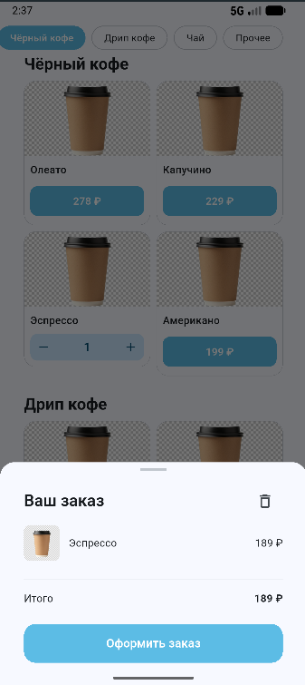
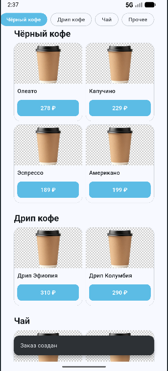
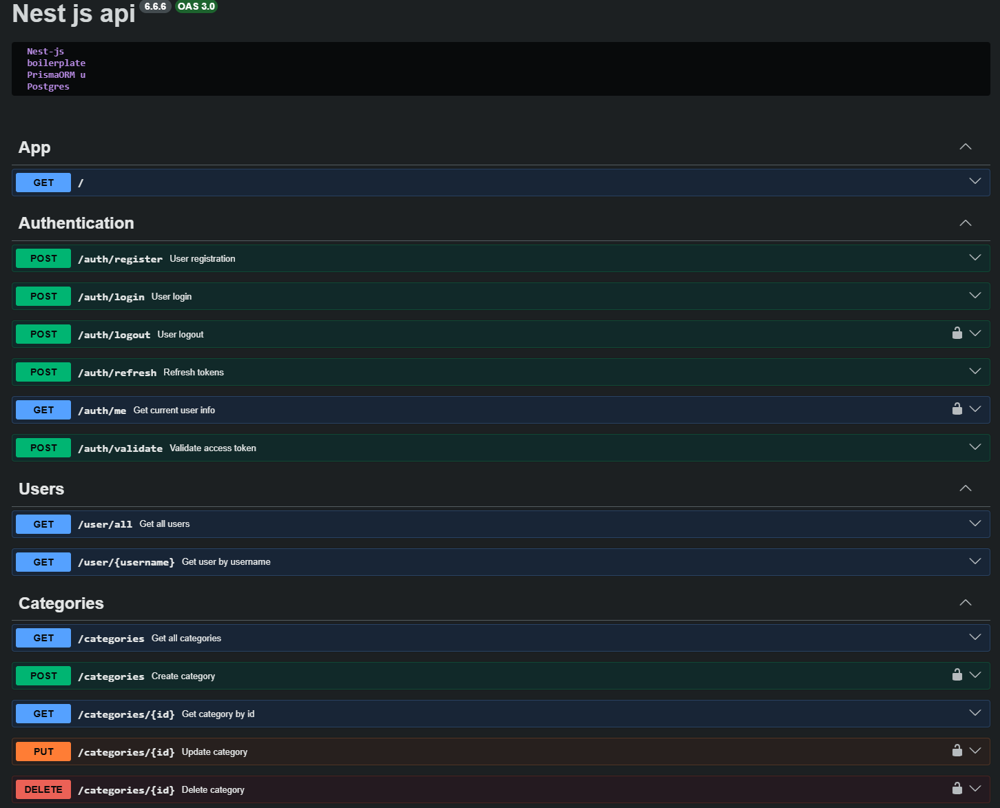
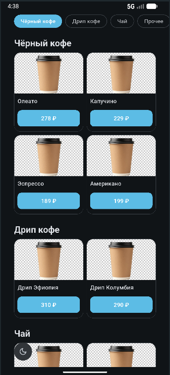
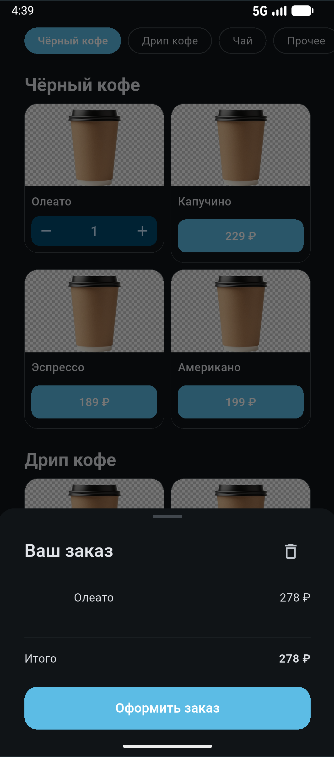
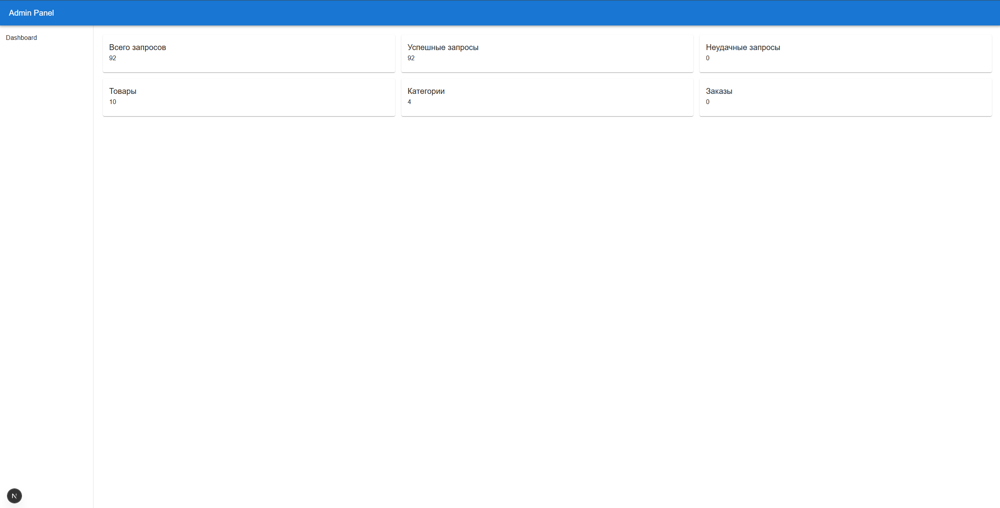

# ☕ RandomCoffee

Мобильное приложение для заказа кофе и выпечки, написанное на Flutter.

## Скриншоты

<p float="left">
  
  
  
  
  
  
  
</p>

### Admin panel



## О проекте

RandomCoffee — это учебное Flutter-приложение с меню кофейни. Пользователь может просматривать позиции по категориям, добавлять товары в корзину и управлять количеством.

## Стек

- **Flutter** — UI
- **Provider** — управление состоянием
- **cached_network_image** — загрузка изображений
- **REST API** — бэкенд на основе HTTP-клиента с токен-авторизацией

## Функциональность

- Каталог товаров с категориями
- Корзина с управлением количеством
- Светлая и тёмная тема
- Кэширование изображений

## Запуск

```bash
flutter pub get
flutter run
```